# Django Blog System - Full-Stack Web Application

[](https://www.python.org/downloads/)
[](https://www.djangoproject.com/)
[](https://www.docker.com/)
[](https://www.postgresql.org/)
[](LICENSE)

A modern, full-featured blog system built with Django, featuring containerized deployment, RESTful APIs, and comprehensive content management capabilities. This project demonstrates production-ready web development practices with Docker containerization and AWS cloud deployment.

## 🏗️ System Architecture

```mermaid
graph TB
    %% User Layer
    User[👤 User] --> Nginx[🔄 Nginx<br/>Reverse Proxy]
    
    %% Load Balancer & Reverse Proxy
    Nginx --> |Port 80/443| Django[🐍 Django Web App<br/>Gunicorn Server]
    Nginx --> |Static Files| StaticFiles[📁 Static Files<br/>CSS, JS, Images]
    Nginx --> |Media Files| MediaFiles[📁 Media Files<br/>User Uploads]
    
    %% Application Layer
    Django --> |ORM| PostgreSQL[(🐘 PostgreSQL<br/>Database)]
    Django --> |REST API| API[📡 Django REST Framework<br/>API Endpoints]
    
    %% Docker Container Structure
    subgraph "🐳 Docker Environment"
        subgraph "Web Container"
            Django
            API
        end
        
        subgraph "Database Container"
            PostgreSQL
        end
        
        subgraph "Nginx Container"
            Nginx
        end
        
        subgraph "Shared Volumes"
            StaticFiles
            MediaFiles
        end
    end
    
    %% External Services
    Django --> |Deployment| AWS[☁️ AWS EC2<br/>Cloud Server]
    PostgreSQL --> |Persistent Storage| DockerVolumes[💾 Docker Volumes<br/>Data Persistence]
    
    %% Admin Interface
    Django --> |Admin Panel| Admin[⚙️ Django Admin<br/>Content Management]
    
    %% Features
    subgraph "🎯 Core Features"
        BlogPosts[📝 Blog Posts]
        UserAuth[🔐 User Authentication]
        Comments[💬 Comments System]
        Categories[📂 Categories & Tags]
        Search[🔍 Search Functionality]
        AboutPage[👨‍💻 About Page with<br/>Dynamic Editing]
    end
    
    Django --> BlogPosts
    Django --> UserAuth
    Django --> Comments
    Django --> Categories
    Django --> Search
    Django --> AboutPage
```



## 🚀 Technology Stack

### Backend
- **Framework**: Django 5.0+ (Python Web Framework)
- **Database**: PostgreSQL 15+ (Production Database)
- **API**: Django REST Framework (RESTful API)
- **Server**: Gunicorn (WSGI HTTP Server)
- **Authentication**: Django Authentication System

### Frontend
- **Templates**: Django Templates with Bootstrap 5
- **Styling**: CSS3, Bootstrap 5, Custom CSS
- **JavaScript**: Vanilla JS, jQuery
- **Icons**: Font Awesome

### DevOps & Infrastructure
- **Containerization**: Docker & Docker Compose
- **Reverse Proxy**: Nginx
- **Cloud Platform**: AWS EC2
- **CI/CD**: GitHub Actions (Optional)
- **Process Management**: Docker Compose

### Development Tools
- **Version Control**: Git
- **Package Management**: pip, requirements.txt
- **Environment Management**: Python venv
- **Database Migrations**: Django Migrations

## 📁 Project Structure

```
myblog/
├── 🐳 Docker Configuration
│   ├── Dockerfile                 # Web application container
│   ├── docker-compose.yml         # Development environment
│   ├── docker-compose.prod.yml    # Production environment
│   └── nginx/
│       └── nginx.conf             # Nginx reverse proxy config
│
├── 🚀 Deployment Scripts
│   ├── deploy.sh                  # General deployment script
│   ├── deploy_fresh.sh           # Fresh deployment script
│   └── migrate_data.sh           # Data migration script
│
├── 🌐 Django Applications
│   ├── blog/                     # Core blog functionality
│   │   ├── models.py            # Data models (Post, Category, Tag, etc.)
│   │   ├── views.py             # View controllers
│   │   ├── urls.py              # URL routing
│   │   ├── admin.py             # Admin interface configuration
│   │   ├── forms.py             # Form definitions
│   │   ├── serializers.py       # API serializers
│   │   ├── templates/           # HTML templates
│   │   ├── static/              # Static files (CSS, JS, images)
│   │   └── management/          # Custom management commands
│   │
│   ├── users/                   # User management
│   │   ├── models.py           # User profile models
│   │   ├── views.py            # User views
│   │   ├── forms.py            # User forms
│   │   └── templates/          # User templates
│   │
│   └── blog_project/           # Project configuration
│       ├── settings.py         # Django settings
│       ├── urls.py             # Main URL configuration
│       ├── wsgi.py             # WSGI configuration
│       └── asgi.py             # ASGI configuration
│
├── 📄 Configuration Files
│   ├── requirements.txt         # Python dependencies
│   ├── manage.py               # Django management script
│   └── run.sh                  # Local development script
│
└── 📊 Static & Media Files
    ├── static/                 # Collected static files
    ├── staticfiles/           # Static files source
    ├── media/                 # User uploaded files
    └── templates/             # Global templates
```

## ✨ Core Features

### 📝 Blog Management
- **Article Creation**: Rich text editor with markdown support
- **Category & Tag System**: Hierarchical content organization
- **Publishing Control**: Draft/Published status management
- **SEO Optimization**: URL slugs, meta descriptions
- **Cover Images**: Article thumbnail support

### 👤 User Management
- **User Registration**: Email-based registration system
- **Profile Management**: Customizable user profiles
- **Avatar Upload**: Profile picture functionality
- **Permission System**: Role-based access control

### 💬 Interactive Features
- **Comment System**: Nested comments with moderation
- **Search Functionality**: Full-text search across articles
- **Archive System**: Date-based article organization
- **Responsive Design**: Mobile-friendly interface

### 🎯 About Page System
- **Dynamic Editing**: Real-time content editing
- **Professional Profile**: Work experience, education, skills
- **Modular Design**: Section-based content management
- **Form-based Editing**: User-friendly editing interface

### 🔧 API Endpoints
- **RESTful API**: Django REST Framework integration
- **Authentication**: Token-based API authentication
- **CRUD Operations**: Full Create, Read, Update, Delete support
- **Pagination**: Efficient data loading

## 🛠️ Installation & Setup

### Prerequisites
- Python 3.11+
- Docker & Docker Compose
- Git
- PostgreSQL (for local development)

### Local Development Setup

1. **Clone the Repository**
   ```bash
   git clone https://github.com/sue686/myblog.git
   cd myblog
   ```

2. **Set Up Virtual Environment**
   ```bash
   python -m venv .venv
   source .venv/bin/activate  # On Windows: .venv\Scripts\activate
   ```

3. **Install Dependencies**
   ```bash
   pip install -r requirements.txt
   ```

4. **Environment Configuration**
   ```bash
   # Create .env file
   cp .env.example .env
   # Edit .env with your configuration
   ```

5. **Database Setup**
   ```bash
   python manage.py migrate
   python manage.py createsuperuser
   ```

6. **Run Development Server**
   ```bash
   python manage.py runserver
   # Or use the provided script
   chmod +x run.sh && ./run.sh
   ```

### Docker Development Setup

1. **Build and Run with Docker Compose**
   ```bash
   docker-compose up --build
   ```

2. **Create Superuser**
   ```bash
   docker-compose exec web python manage.py createsuperuser
   ```

3. **Access the Application**
   - Website: http://localhost:8000
   - Admin Panel: http://localhost:8000/admin/

## 🌐 Production Deployment

### AWS EC2 Deployment

#### Prerequisites
- AWS EC2 instance (Ubuntu/Amazon Linux)
- SSH access to the server
- Domain name (optional)

#### Automated Deployment

1. **Fresh Deployment** (New server)
   ```bash
   # On your EC2 instance
   git clone https://github.com/sue686/myblog.git
   cd myblog
   chmod +x deploy_fresh.sh
   ./deploy_fresh.sh
   ```

2. **Update Deployment** (Existing server)
   ```bash
   # On your EC2 instance
   cd myblog
   chmod +x deploy.sh
   ./deploy.sh
   ```

#### Manual Deployment Steps

1. **Server Preparation**
   ```bash
   # Update system
   sudo apt update && sudo apt upgrade -y
   
   # Install Docker
   sudo apt install -y docker.io docker-compose
   sudo systemctl start docker
   sudo systemctl enable docker
   sudo usermod -aG docker $USER
   ```

2. **Application Deployment**
   ```bash
   # Clone repository
   git clone https://github.com/sue686/myblog.git
   cd myblog
   
   # Build and start services
   docker-compose -f docker-compose.prod.yml up --build -d
   
   # Create superuser
   docker-compose -f docker-compose.prod.yml exec web python manage.py createsuperuser
   ```

3. **Service Management**
   ```bash
   # View logs
   docker-compose -f docker-compose.prod.yml logs -f
   
   # Restart services
   docker-compose -f docker-compose.prod.yml restart
   
   # Stop services
   docker-compose -f docker-compose.prod.yml down
   ```

#### Production Environment Variables

```env
# Database Configuration
DB_NAME=myblogdb
DB_USER=postgres
DB_PASSWORD=your_secure_password
DB_HOST=db
DB_PORT=5432

# Django Settings
DEBUG=False
SECRET_KEY=your_secret_key_here
ALLOWED_HOSTS=your-domain.com,www.your-domain.com,server-ip

# Email Configuration (Optional)
EMAIL_HOST=smtp.gmail.com
EMAIL_PORT=587
EMAIL_USE_TLS=True
EMAIL_HOST_USER=your-email@gmail.com
EMAIL_HOST_PASSWORD=your-email-password
```

## 📊 API Documentation

### Authentication
```bash
# Obtain token
POST /api/auth/login/
{
    "username": "your_username",
    "password": "your_password"
}

# Use token in headers
Authorization: Token your_token_here
```

### Blog Endpoints
```bash
# List all posts
GET /api/posts/

# Get specific post
GET /api/posts/{id}/

# Create new post (authenticated)
POST /api/posts/
{
    "title": "Post Title",
    "content": "Post content...",
    "category": 1,
    "tags": [1, 2, 3],
    "is_published": true
}

# Update post (authenticated)
PUT /api/posts/{id}/

# Delete post (authenticated)
DELETE /api/posts/{id}/
```

### User Endpoints
```bash
# User registration
POST /api/users/register/
{
    "username": "newuser",
    "email": "user@example.com",
    "password": "securepassword"
}

# User profile
GET /api/users/profile/
PUT /api/users/profile/
```

## 🔧 Management Commands

### Custom Django Commands

```bash
# Generate blog statistics
python manage.py blog_stats

# Fix URL slugs
python manage.py fix_slugs

# Collect static files
python manage.py collectstatic

# Database backup
python manage.py dbbackup

# Database restore
python manage.py dbrestore
```

### Docker Commands

```bash
# View running containers
docker-compose ps

# Execute commands in container
docker-compose exec web python manage.py shell

# View container logs
docker-compose logs web

# Restart specific service
docker-compose restart web

# Scale services
docker-compose up --scale web=3
```

## 🧪 Testing

### Running Tests
```bash
# Run all tests
python manage.py test

# Run specific app tests
python manage.py test blog

# Run with coverage
coverage run --source='.' manage.py test
coverage report
coverage html
```

### Test Categories
- **Unit Tests**: Model and form validation
- **Integration Tests**: View and API functionality
- **Functional Tests**: End-to-end user workflows

## 📈 Performance Optimization

### Database Optimization
- **Indexing**: Optimized database indexes
- **Query Optimization**: Efficient ORM queries
- **Connection Pooling**: Database connection management

### Caching Strategy
- **Static Files**: Nginx static file serving
- **Database Queries**: Query result caching
- **Template Caching**: Rendered template caching

### Security Features
- **CSRF Protection**: Cross-site request forgery protection
- **SQL Injection Prevention**: ORM-based query protection
- **XSS Protection**: Template auto-escaping
- **HTTPS Support**: SSL/TLS encryption ready

## 🔍 Monitoring & Logging

### Application Monitoring
```bash
# View application logs
docker-compose logs -f web

# Monitor system resources
docker stats

# Database monitoring
docker-compose exec db psql -U postgres -d myblogdb -c "\dt"
```

### Health Checks
- **Database Connection**: Automatic health checks
- **Service Status**: Container health monitoring
- **Performance Metrics**: Response time tracking

## 🚨 Troubleshooting

### Common Issues

1. **Database Connection Issues**
   ```bash
   # Check database status
   docker-compose exec db pg_isready -U postgres
   
   # Reset database
   docker-compose down
   docker volume rm myblog_postgres_data
   docker-compose up -d
   ```

2. **Static Files Not Loading**
   ```bash
   # Collect static files
   docker-compose exec web python manage.py collectstatic --noinput
   
   # Check nginx configuration
   docker-compose exec nginx nginx -t
   ```

3. **Permission Issues**
   ```bash
   # Fix file permissions
   sudo chown -R $USER:$USER .
   chmod +x deploy.sh deploy_fresh.sh
   ```

### Debug Mode
```bash
# Enable debug mode
export DEBUG=True
docker-compose restart web

# View detailed error logs
docker-compose logs web --tail=100
```

## 📝 Contributing

### Development Workflow
1. Fork the repository
2. Create a feature branch (`git checkout -b feature/amazing-feature`)
3. Commit your changes (`git commit -m 'Add amazing feature'`)
4. Push to the branch (`git push origin feature/amazing-feature`)
5. Open a Pull Request

### Code Standards
- **PEP 8**: Python code style guide
- **Django Best Practices**: Follow Django conventions
- **Documentation**: Comment complex logic
- **Testing**: Write tests for new features

## 📜 License

This project is licensed under the MIT License - see the [LICENSE](LICENSE) file for details.

## 🙏 Acknowledgments

- Django community for the excellent framework
- Bootstrap team for the responsive UI components
- Docker team for containerization technology
- AWS for cloud infrastructure
- Open source contributors

## 📞 Support

For support, email your-email@example.com or create an issue in the GitHub repository.

## 🔗 Links

- **Live Demo**: [http://your-domain.com](http://your-domain.com)
- **Documentation**: [Project Wiki](https://github.com/sue686/myblog/wiki)
- **Issues**: [GitHub Issues](https://github.com/sue686/myblog/issues)
- **Discussions**: [GitHub Discussions](https://github.com/sue686/myblog/discussions)

---

**Built with ❤️ using Django, Docker, and AWS** 